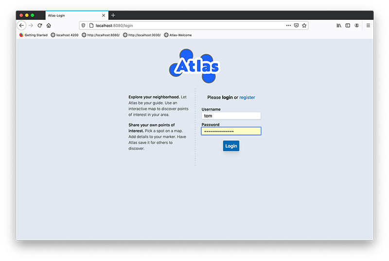
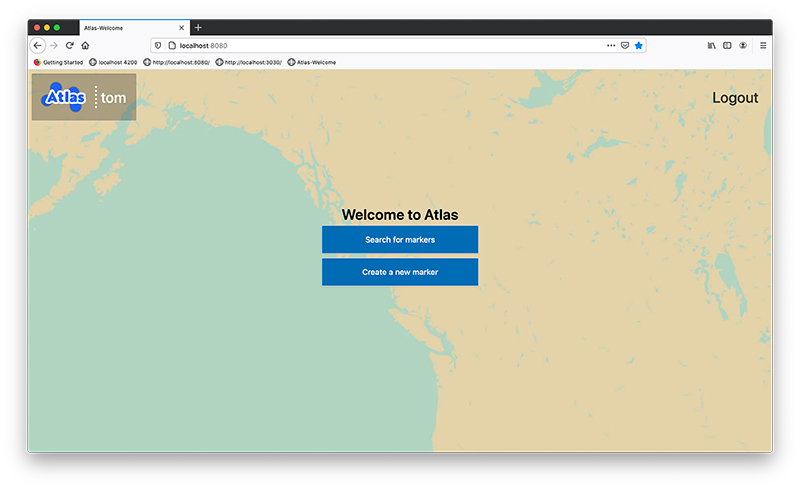
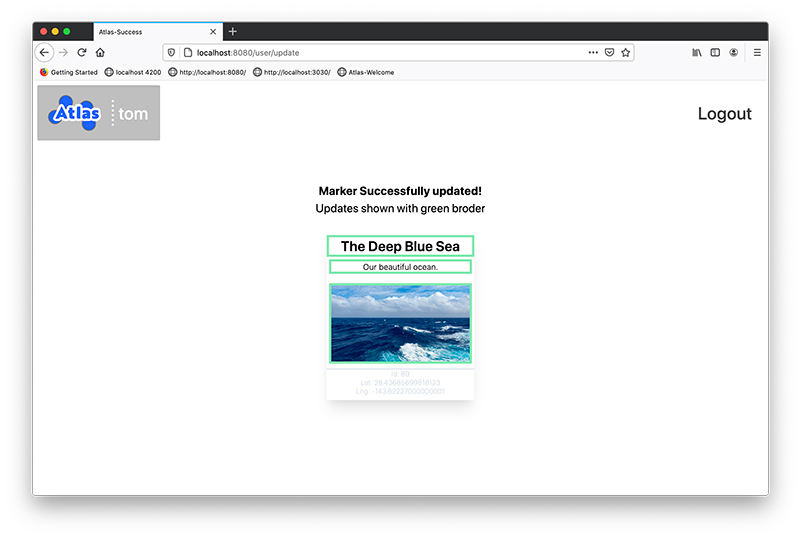
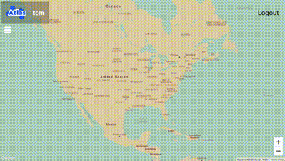

# Atlas
#### Imagine taking a walk in your neighborhood with a personal tour guide.

Atlas is a web app that lets people add a [marker](#marker) and view markers for an area. In addition to its [location](#location) data, each marker supports several other [attributes](#marker-attribute). 

Beyond the structure for posting and sharing there is little else in Atlas to dictate the nature of the content. People will be encouraged to share what they find interesting. I hope by seeing a broad collection of details (our content) we can get a glimpse of the much larger whole, the neighborhood.
## Background
I have always been ready for a quick history lesson or story. Walking my neighborhood, I am lucky to have found neighbors willing to indulge me. Over time, I have come to appreciate the way our physical environment prompts us into sharing some detail of the past. I wanted a way to share these stories and observations and hoped a web app would allow for such an experience. 

Let the experiment begin.
## Tech/Frameworks
Completed in the MVC style using:
- Spring (Java)
- Thymeleaf
- PostgreSQL
- PostGIS
- Gradle
- Google Map API

It wouldn't hurt to have at least a basic understanding of:
- Model binding with Spring
- HTTP sessions
- Spring MVC
- SQL queries
- Google Map Platform
    
## Features
- Secure login
- Create a marker at a specific location
- View markers for an area
- Set marker text attribute
- Set marker name attribute
- Set marker photo attribute
- Marker and user data persist

## So you forked it... now what?

Atlas will need to be configured to connect with a database.
[PostgreSQL](https://www.postgresql.org) and the extension [PostGIS](https://postgis.net) were chosen and required for easier querying.

### Local Configuration:
Atlas requires a connection to a PostgreSQL database. The connection can be found in [application.properties](src/main/resources/application.properties) and is set using local environment variables.

Atlas also uses [Google Map API](https://developers.google.com/maps/documentation) and is subject to Google's constraints. At the time of writing, relatively low usage of Google Maps is free. Its connection uses an environment variable. See table below.

Environment Variable | Value
-------- | ---------
PASS| [database password]
PORT| [typically 5432 for local port]
HOST| [local host xxx.x.x.x]
DBUSER| [database username]
NAME| [database name]
Google_Map_API_key | [Your Google MAP API key]

### Notes on branches:
Feel free to use as you see fit but commits may be easier to follow knowing how I worked.

branch | description
------ | :-----------
master | receives stable finished code from development
development | a place where features come together before moving to master
feature (and subset feature-xxxx-xxxx) | working space for getting code stable and ready to add to development or back to its parent.

## Future
### Dreams ––

- Take a tour. Save a set of markers and walking directions will guide a user from marker to marker. Allowing a user to walk someones historical home tour.

- Users can log requests for information by making an "open" marker, to be handed off to another user. The goal would be to increase collaboration, build contributions, and result in an improved user experience. 

- Advanced search and tagging features (such as ability to add custom marker attributes) would make for a richer experience.

- Atlas API. API access could be used to create different flavors of Atlas, so that for example, *Atlas-Plants* will only contain markers about plants. The marker *attributes* and *search* features would also be tailored to plants.  

Contributions are welcomed but adoption may be slow.

## Credit
Special thanks to [LauchCode](https://www.launchcode.org/), whose guidance and support made this project possible.

## Definitions
##### Marker
: a specific spot on a map tied to a location and possessing attributes
##### Marker attribute
: any supporting data, not including a marker's location
##### Location 
: GeoPoint or Longitude and Latitude (38°37'29.0"N 90°11'04.8"W) or (38.624724, -90.184664)

###ScreenShots

## License
Full text for [License](LICENSE).

MIT © Tom Petty 2020

